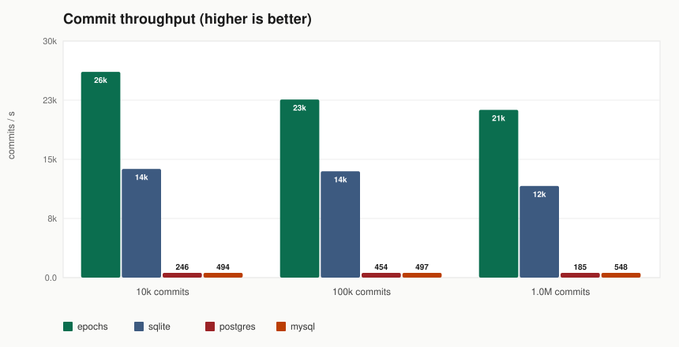
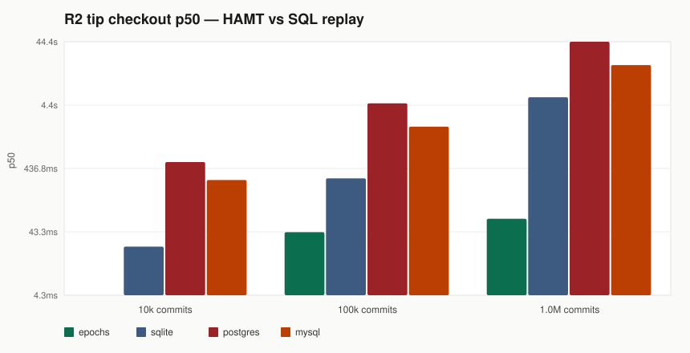
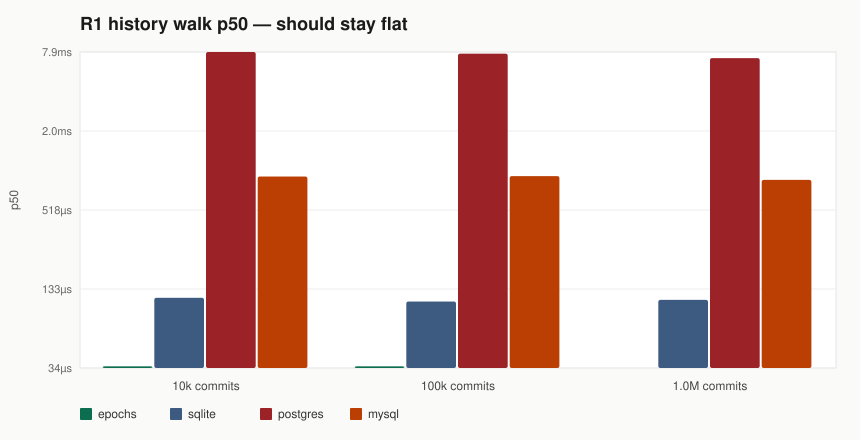

# epochs-bench — versioned KV / commit DAG

Default workload is **deep history**: a **fixed live key set** updated over many
commits (git-like).

## Charts

Grouped bars (engines × scale). Data: [`ladder.csv`](ladder.csv).







More: [RESULTS.md](RESULTS.md) · regenerate with `python3 benches/charts/render.py --csv benches/ladder.csv --out benches/charts`

## Fair environment

All engines: **2 CPUs + 2 GiB**, sequential, SQL server+client in one cgroup.

```bash
./benches/run.sh smoke
./benches/run-ladder.sh --quick
```

## What we compare

| Metric | Why |
|--------|-----|
| **W1 commit/s + p50** | Write path as history grows |
| **R1 history p50** | Fixed-depth walk — should stay **flat** |
| **R2 tip checkout p50** | epochs: HAMT(#keys); SQL: replay all deltas |
| **Disk / cgroup mem** | Retention + RSS |

## Tiers (deep defaults)

| Tier | Live keys | Commits |
|------|-----------|---------|
| `smoke` | 1 000 | 10 000 |
| `dev` | 10 000 | 100 000 |
| `mid` | 10 000 | 1 000 000 |
| `large` | 100 000 | 5 000 000 |
| `heavy` | 100 000 | 50 000 000 | `--force` |
