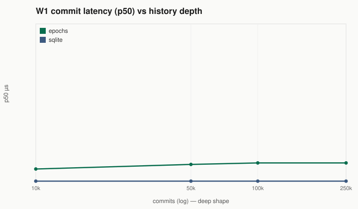
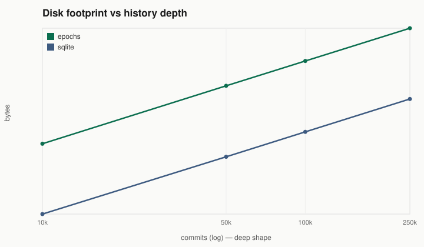
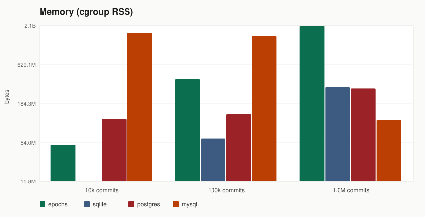

# Results — deep history (bounded keys)

Fair Docker, 2 CPU / 2 GiB per engine. Source: [`ladder.csv`](ladder.csv).

## Mid headline (10 000 keys × 1 000 000 commits)

| engine | commit/s | R1 p50 | R2 tip p50 |
|--------|----------|--------|------------|
| **epochs** | **21 354** | **34 µs** | **70 ms** |
| sqlite | 11 662 | 110 µs | 5.9 s |
| mysql | 548 | 871 µs | 19 s |
| postgres | 185 | 7.1 ms | 44 s |

Tip checkout stays ~ms–tens of ms for epochs (HAMT of live keys); SQL delta-replay grows with history.

## Charts (grouped bars)








```bash
python3 benches/charts/render.py --csv benches/ladder.csv --out benches/charts
```
